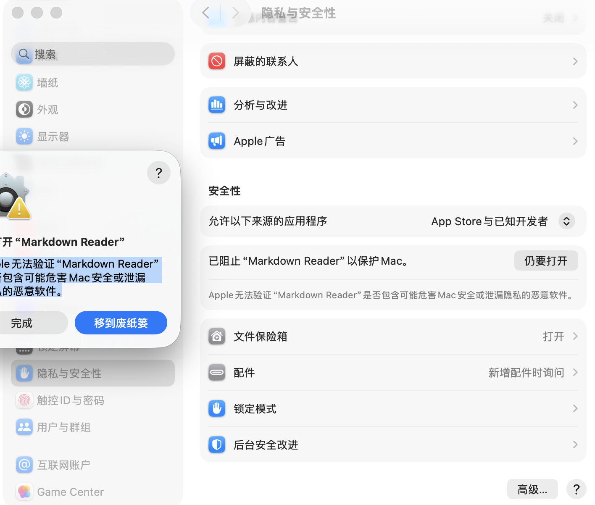

# Markdown Reader

A desktop app for scanning, organizing, and reading Markdown documents from a folder.


## Highlights

- Open one folder and recursively scan all `.md` and `.markdown` files
- Browse documents with a sidebar directory tree
- Search files by name or relative path
- Read Markdown in a clean preview pane
- Better rendering for headings, lists, blockquotes, tables, task lists, code blocks, and links
- Copy selected text from the preview pane
- Zoom the preview with `Ctrl + Mouse Wheel`, `Ctrl + +`, `Ctrl + -`, and `Ctrl + 0`
- Navigate long documents with a generated heading outline
- Native desktop implementations for both macOS and Windows
- Custom app icon source included in the repo

## Why This App

Markdown Reader is designed for local documentation sets, notes collections, and project folders where you want:

- A lightweight desktop reader instead of a browser-heavy workflow
- Fast folder-based browsing without importing files into a database
- A readable preview for structured Markdown documents

## Platforms

### macOS

The original app is a native AppKit application written in Objective-C.

Build:

Run:

```bash
chmod +x build.sh
./build.sh
```

After the build finishes, the app bundle will be created at:

```bash
/Users/jiahao/Documents/Codex/2026-04-24-markdown-mac/build/Markdown Reader.app
```

The build also creates a release-ready zip archive at:

```bash
/Users/jiahao/Documents/Codex/2026-04-24-markdown-mac/build/Markdown-Reader-macOS.zip
```

You can move the `.app` to `/Applications`, or upload the `.zip` file to a GitHub Release.

### Windows

The Windows app lives in `Windows/markdown_reader.pyw` and is implemented with Python + Tkinter. It prefers repo-local dependencies from `.tools\python-deps`, so Markdown parsing stays consistent without requiring a global Python setup.

Windows reading features:

- Recursive Markdown scanning
- Sidebar directory tree
- File search
- Styled preview for headings, lists, task lists, tables, quotes, code blocks, and links
- Copy, select-all, and context menu support in the preview
- Zoom controls for the reading view
- Per-document outline with click-to-jump navigation
- Local file links and web links

Run locally:

```powershell
.\run_windows.cmd
```

Open a folder immediately:

```powershell
.\run_windows.cmd C:\path\to\docs
```

Build a portable Windows package:

```powershell
.\build_windows.ps1
```

That script creates:

```text
build\Markdown-Reader-Windows\
build\Markdown-Reader-Windows-portable.zip
```

Build a standalone Windows `.exe` package:

```powershell
.\build_windows_exe.ps1
```

That script creates:

```text
build\exe\Markdown Reader\Markdown Reader.exe
build\Markdown-Reader-Windows-exe.zip
```

The exe build uses PyInstaller and auto-generates a Windows `.ico` file from `Assets/AppIconSource.png`. If the required Python packages are not already available, the script installs them into `.tools\pyinstaller` and `.tools\python-deps` inside this repository.

Portable package notes:

- `Markdown Reader.cmd` launches the app on a machine with Python 3 installed
- The packaged `.tools\python-deps` folder keeps Markdown rendering behavior consistent
- This is useful for internal sharing when a fully bundled `.exe` is not required

Standalone `.exe` notes:

- `Markdown Reader.exe` does not require a separate Python installation
- The executable embeds the generated Windows icon
- If `build\exe\` is locked by a running app, the build script automatically falls back to a timestamped output folder

## GitHub Release Workflow

Recommended release assets:

- `build\Markdown-Reader-macOS.zip`
- `build\Markdown-Reader-Windows-portable.zip`
- `build\Markdown-Reader-Windows-exe.zip`

Recommended release flow:

1. Build the macOS app with `./build.sh`
2. Build the Windows portable package with `.\build_windows.ps1`
3. Build the Windows exe package with `.\build_windows_exe.ps1`
4. Smoke-test each build on its target platform
5. Create a Git tag such as `v1.1.0`
6. Upload the three zip archives to a GitHub Release

Suggested naming:

- macOS: `Markdown-Reader-macOS.zip`
- Windows portable: `Markdown-Reader-Windows-portable.zip`
- Windows exe: `Markdown-Reader-Windows-exe.zip`

## First Launch on macOS

Because the app is not notarized with an Apple Developer ID yet, macOS may block it the first time you open it.

If you see a warning, open:

`System Settings > Privacy & Security`

Then find the blocked app notice and click `Open Anyway` / `仍要打开`.



Recommended steps:

1. Download and unzip the release
2. Move `Markdown Reader.app` to `/Applications`
3. Try opening the app once
4. If macOS blocks it, go to `System Settings > Privacy & Security`
5. Click `Open Anyway` / `仍要打开`
6. Return to the app and confirm `Open`

## Project Structure

- `App/main.m`: main macOS app implementation
- `Windows/markdown_reader.pyw`: main Windows app implementation
- `build.sh`: macOS build script for producing the `.app`
- `build_windows.ps1`: Windows portable packaging script
- `build_windows_exe.ps1`: Windows executable packaging script
- `run_windows.cmd`: Windows launcher
- `Assets/AppIconSource.png`: source artwork for the app icon
- `scripts/generate_icon.py`: generates the `.icns` file used by macOS
- `scripts/generate_windows_icon.py`: generates the `.ico` file used by Windows
- `Resources/Info.plist`: app bundle metadata

## Current Features

- Folder-based Markdown library scanning
- Sidebar navigation tree
- File search
- Markdown preview with headings, tables, task lists, quotes, and code blocks
- Preview copy and zoom controls
- Outline-based heading navigation for long documents
- Native desktop builds for macOS and Windows

## Troubleshooting

Windows:

- If `Markdown Reader.cmd` says Python is missing, install Python 3 for Windows and make sure `pyw`, `pythonw`, or `python` is on `PATH`
- If the exe build fails, rerun `.\build_windows_exe.ps1` after closing any running `Markdown Reader.exe` windows
- If Markdown rendering looks incomplete, delete `.tools\python-deps` and rebuild so the local `markdown` package is reinstalled cleanly

macOS:

- If macOS blocks the app on first launch, use `System Settings > Privacy & Security > Open Anyway`

## Notes

- The macOS app is a native AppKit application written in Objective-C
- The Windows app is a native Tkinter desktop app written in Python
- Generated build artifacts are excluded from git
- Release notes are available in `RELEASE_NOTES.md`
