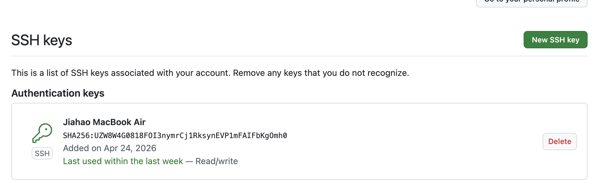

# Markdown Reader for macOS

A native macOS app for scanning, organizing, and reading Markdown documents from a folder.



## Highlights

- Open one folder and recursively scan all `.md` and `.markdown` files
- Browse documents with a sidebar directory tree
- Search files by name or relative path
- Read Markdown in a clean full-width preview pane
- Better rendering for headings, lists, blockquotes, tables, task lists, and code blocks
- Drag a folder directly into the app window
- Native macOS app bundle with a custom app icon

## Why This App

Markdown Reader is designed for local documentation sets, notes collections, and project folders where you want:

- A lightweight native macOS reader instead of a browser-heavy workflow
- Fast folder-based browsing without importing files into a database
- A readable preview for structured Markdown documents

## Screenshot

The app is optimized for reading document collections on macOS with a split layout for navigation and preview.


## Build

Run:

```bash
chmod +x build.sh
./build.sh
```

After the build finishes, the app bundle will be created at:

```bash
/Users/jiahao/Documents/Codex/2026-04-24-markdown-mac/build/Markdown Reader.app
```

You can then move it to `/Applications`.

## Project Structure

- `App/main.m`: main macOS app implementation
- `build.sh`: build script for producing the `.app`
- `Assets/AppIconSource.png`: source artwork for the app icon
- `scripts/generate_icon.py`: generates the `.icns` file used by macOS
- `Resources/Info.plist`: app bundle metadata

## Current Features

- Folder-based Markdown library scanning
- Sidebar navigation tree
- File search
- Drag-and-drop folder opening
- Native app icon packaging
- Standalone `.app` output

## Notes

- This is a native AppKit application written in Objective-C
- The preview is HTML-based for better Markdown styling flexibility
- Generated build artifacts are excluded from git
